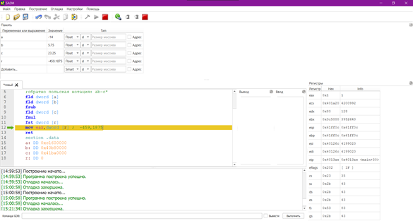

# Лабораторная работа №1: Работа с FPU и регистрами x86 (NASM)

**Дисциплина:** Основы программирования  
**Среда / Инструменты:** NASM x86, SASM (SimpleASM), GDB  

## 🎯 Цели работы
Изучение базовых арифметических операций на языке ассемблера x86, работы со стеком сопроцессора FPU (Floating Point Unit) и управления регистрами общего назначения.

---

## 🛠 Выполненные задачи

### 1. Работа со стеком FPU (Обратная польская нотация)
* **Задание:** Вычисление выражения `(a - b) * c` с использованием вещественных чисел (Float) и сопроцессора FPU.
* **Файл кода:** [`task1_fpu_rpn.asm`](./task1_fpu_rpn.asm)
* **Ключевые инструкции:** `fld`, `fsub`, `fmul`, `fst`.
* **Особенность:** Вычисления производились над плавающей точкой в формате IEEE-754 через стек FPU.

### 2. Прямые вычисления на 16-битных регистрах
* **Задание:** Выполнение арифметики над целыми знаковые числами с использованием регистров `EAX`, `EBX`, `ECX`.
* **Файл кода:** [`task2_registers_direct.asm`](./task2_registers_direct.asm)
* **Ключевые инструкции:** `xor` (для очистки регистров), `sub`, `imul` (знаковое умножение).

---

## 📊 Результаты отладки в SASM
В ходе работы проводился пошаговый анализ состояния флагов и регистров в отладчике SASM:

Полный отчет по лабораторной работе доступен в формате PDF: [Отчет_Лаб1.pdf](./docs/Lab1_Report.pdf).
